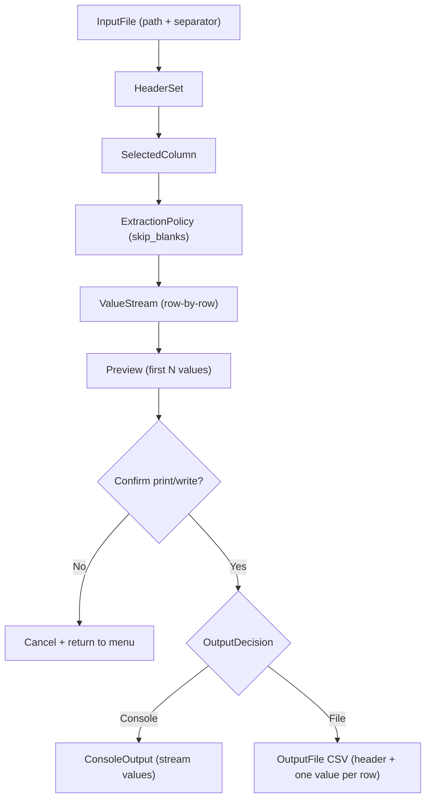

# CSV Ops CLI

`csvops` is a small Ruby CLI for interactive CSV workflows.

## Requirements

- Ruby (tested with Ruby 2.6+)
- `rake`
- `minitest`

Install dependencies:

```bash
bundle install
```

## Usage

Run the interactive menu:

```bash
./bin/tool menu
```

You should see:

```text
CSV Tool Menu
1. Extract column
2. Exit
>
```

Choose `1` to extract a column:

```text
CSV file path: /path/to/file.csv
Choose separator:
1. comma (,)
2. tab (\t)
3. semicolon (;)
4. pipe (|)
5. custom
Separator choice [1]: 1
Filter columns (optional):
Select column:
1. name
2. city
Column number: 1
Skip blank values? [Y/n]:
Preview (first 3 values):
Alice
Bob
Cara
Print all values? [y/N]: y
Output destination:
1. console
2. file
Output destination [1]: 1
Alice
Bob
Cara
```

## Testing

Run tests:

```bash
rake test
```

Or:

```bash
bundle exec rake test
```

## Architecture

The CLI is organized into small single-responsibility classes:

- `Csvtool::CLI` wires command handling and menu startup.
- `Csvtool::MenuLoop` handles menu rendering and routing.
- `Csvtool::ExtractColumnWorkflow` orchestrates extract flow steps.
- `Csvtool::Prompts::*` classes handle one user prompt each.
- `Csvtool::Services::*` classes handle CSV domain operations.
- `Csvtool::Output::*` classes handle output strategies (console/file).
- `Csvtool::Errors::Presenter` centralizes friendly user-facing errors.

## Domain model

The problem domain is "extract values from one selected CSV column with safe interactive controls."

- `InputFile`: CSV source selected by path + separator.
- `HeaderSet`: headers discovered from `InputFile`.
- `SelectedColumn`: one header chosen by filtered interactive selection.
- `ExtractionPolicy`: options that affect extraction behavior (`skip_blanks`).
- `Preview`: first `N` extracted values shown before execution.
- `OutputDecision`: user confirmation (`print all?`) plus destination choice (`console` or `file`).
- `OutputFile`: optional CSV sink for extracted values (single-column CSV with header).



## Project layout

```text
bin/tool              # CLI entrypoint
lib/csvtool/cli.rb
lib/csvtool/menu_loop.rb
lib/csvtool/extract_column_workflow.rb
lib/csvtool/prompts/*            # focused input prompts
lib/csvtool/services/*           # header read, streaming, preview
lib/csvtool/output/*             # console/file writers
lib/csvtool/errors/presenter.rb
test/csvtool/cli_test.rb         # end-to-end workflow tests
test/csvtool/**/*_test.rb        # focused unit tests by component folder
test/test_helper.rb
```
