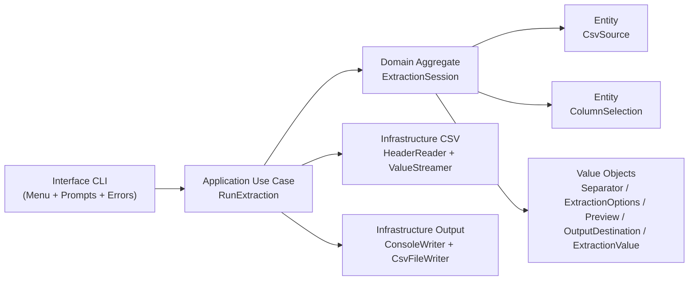

# CSV Ops CLI

`csvops` is a small Ruby CLI for interactive CSV workflows.

## Requirements

- Ruby (tested with Ruby 2.6+)
- `rake`
- `minitest`

Install dependencies:

```bash
bundle install
```

## Usage

Run the interactive menu:

```bash
./bin/tool menu
```

You should see:

```text
CSV Tool Menu
1. Extract column
2. Exit
>
```

Choose `1` to extract a column:

```text
CSV file path: /path/to/file.csv
Choose separator:
1. comma (,)
2. tab (\t)
3. semicolon (;)
4. pipe (|)
5. custom
Separator choice [1]: 1
Filter columns (optional):
Select column:
1. name
2. city
Column number: 1
Skip blank values? [Y/n]:
Preview (first 3 values):
Alice
Bob
Cara
Print all values? [y/N]: y
Output destination:
1. console
2. file
Output destination [1]: 1
Alice
Bob
Cara
```

## Testing

Run tests:

```bash
rake test
```

Or:

```bash
bundle exec rake test
```

## Architecture

The codebase follows a DDD-lite layered structure:

- `domain/`: core domain model and invariants (`ExtractionSession` aggregate + value objects/entities).
- `application/`: use-case orchestration (`RunExtraction`).
- `infrastructure/`: CSV reading/streaming and output adapters (console/file).
- `interface/cli/`: menu, prompts, and user-facing error presentation.
- `Csvtool::CLI`: entrypoint wiring from command args to interface/application flow.

## Domain model

Bounded context: `Column Extraction`.

Core DDD structure:

- Aggregate root: `ExtractionSession`
  - Controls extraction state transitions (`start`, `with_preview`, `confirm!`, `with_output_destination`).
  - Enforces session-level invariants.
- Entities:
  - `CsvSource` (file path + `Separator`)
  - `ColumnSelection` (chosen header)
- Value objects:
  - `Separator`
  - `ExtractionOptions` (`skip_blanks`, `preview_limit`)
  - `Preview` (list of `ExtractionValue`)
  - `ExtractionValue`
  - `OutputDestination` (`console` or `file(path)`)
- Application service:
  - `Application::UseCases::RunExtraction` orchestrates one extraction request.
- Infrastructure adapters:
  - `Infrastructure::CSV::HeaderReader`
  - `Infrastructure::CSV::ValueStreamer`
  - `Infrastructure::Output::ConsoleWriter`
  - `Infrastructure::Output::CsvFileWriter`
- Interface adapters:
  - `Interface::CLI::MenuLoop`
  - `Interface::CLI::Prompts::*`
  - `Interface::CLI::Errors::Presenter`



## Project layout

```text
bin/tool              # CLI entrypoint
lib/csvtool/cli.rb
lib/csvtool/domain/extraction_session/*
lib/csvtool/application/use_cases/run_extraction.rb
lib/csvtool/infrastructure/csv/*
lib/csvtool/infrastructure/output/*
lib/csvtool/interface/cli/menu_loop.rb
lib/csvtool/interface/cli/prompts/*
lib/csvtool/interface/cli/errors/presenter.rb
test/csvtool/cli_test.rb         # end-to-end workflow tests
test/csvtool/**/*_test.rb        # focused unit tests by component folder
test/test_helper.rb
```
