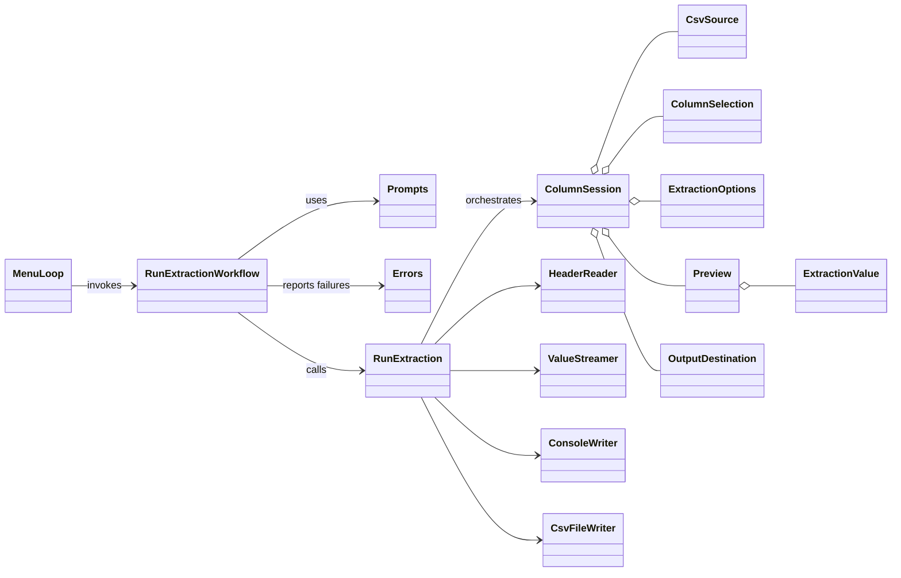
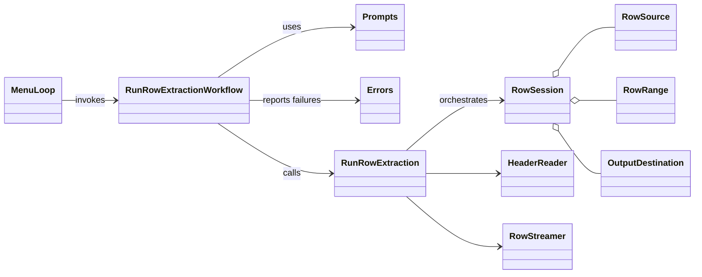
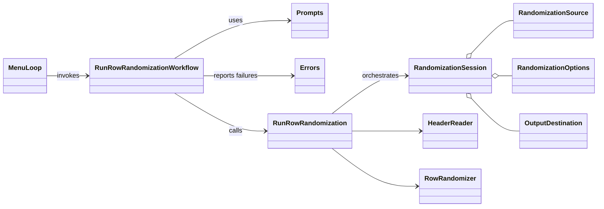
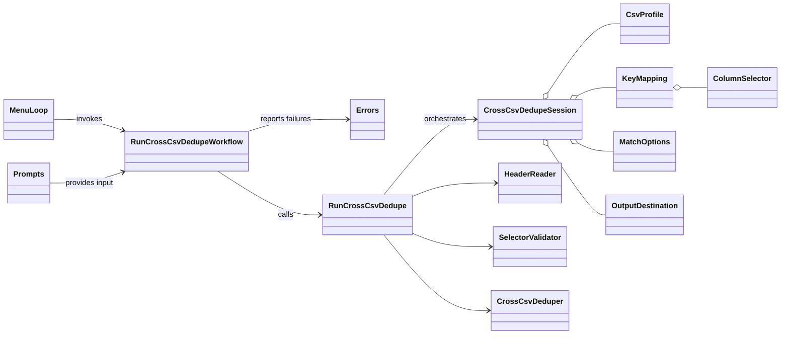

# Architecture

The codebase follows a DDD-lite layered structure:

- `domain/`: core domain models and invariants (`ColumnSession`, `RowSession`, `RandomizationSession`, and `CrossCsvDedupeSession` aggregates + supporting entities/value objects).
- `application/`: use-case orchestration (`RunExtraction`, `RunRowExtraction`, `RunRowRandomization`, `RunCrossCsvDedupe`).
- `infrastructure/`: CSV reading/streaming and output adapters (console/file), plus cross-CSV dedupe adapter.
- `interface/cli/`: menu, prompts, workflows, and user-facing error presentation.
- `Csvtool::CLI`: entrypoint wiring from command args to interface/application flow.

## Workflow boundary (standardized)

For all interactive domains (`Column Extraction`, `Row Extraction`, `Row Randomization`, `Cross-CSV Dedupe`), the boundary is:

- `interface/cli/workflows/*`: owns prompts, stdout rendering, and user-facing error presentation.
- `application/use_cases/*`: interface-agnostic orchestration with request/result style contracts.
- `domain/*`: invariants and domain policies.
- `infrastructure/*`: CSV mechanics and output adapters.

## Domain model

Bounded contexts: `Column Extraction`, `Row Extraction`, `Row Randomization`, and `Cross-CSV Dedupe`.

### Cross-CSV Dedupe (Large-file behavior)

- Workflow: remove rows from a source CSV when source key matches a key from a reference CSV.
- Scaling strategy:
  - Reference CSV keys are loaded into a `Set` for fast membership checks.
  - Source CSV rows are streamed directly to the selected output destination (console or file).
- Memory tradeoff:
  - Memory is dominated by the number of unique keys in the reference CSV.
  - Source-row memory stays bounded because retained rows are not accumulated in memory before writing.

### Column Extraction

- Aggregate root: `ColumnSession`
  - Controls extraction state transitions (`start`, `with_preview`, `confirm!`, `with_output_destination`).
  - Enforces session-level invariants.
- Entities:
  - `CsvSource` (file path + `Separator`)
  - `ColumnSelection` (chosen header)
- Value objects:
  - `Separator`
  - `ExtractionOptions` (`skip_blanks`, `preview_limit`)
  - `Preview` (list of `ExtractionValue`)
  - `ExtractionValue`
  - Shared `OutputDestination` (`console` or `file(path)`)
- Application service:
  - `Application::UseCases::RunExtraction` is interface-agnostic and exposes request/result operations.
- Infrastructure adapters:
  - `Infrastructure::CSV::HeaderReader`
  - `Infrastructure::CSV::ValueStreamer`
  - `Infrastructure::Output::ConsoleWriter`
  - `Infrastructure::Output::CsvFileWriter`
- Interface adapters:
  - `Interface::CLI::MenuLoop`
  - `Interface::CLI::Workflows::RunExtractionWorkflow`
  - `Interface::CLI::Prompts::*`
  - `Interface::CLI::Errors::Presenter`



### Row Extraction

Core DDD structure:

- Aggregate root: `RowSession`
  - Captures one row-range extraction request.
  - Holds selected source, requested range, and output destination.
- Entity:
  - `RowSource` (file path + separator)
- Value objects:
  - `RowRange` (`start_row`, `end_row`) plus row-range validation errors
  - Shared `OutputDestination` (`console` or `file(path)`)
- Application service:
  - `Application::UseCases::RunRowExtraction` is interface-agnostic and exposes request/result operations.
- Infrastructure adapters:
  - `Infrastructure::CSV::HeaderReader`
  - `Infrastructure::CSV::RowStreamer`
- Interface adapters:
  - `Interface::CLI::MenuLoop`
  - `Interface::CLI::Workflows::RunRowExtractionWorkflow`
  - `Interface::CLI::Prompts::*`
  - `Interface::CLI::Errors::Presenter`



### Row Randomization

Core DDD structure:

- Aggregate root: `RandomizationSession`
  - Captures one randomization request from source + options + output destination.
- Entity:
  - `RandomizationSource` (file path + separator + header mode)
- Value objects:
  - `RandomizationOptions` (optional deterministic `seed`)
  - Shared `OutputDestination` (`console` or `file(path)`)
- Application service:
  - `Application::UseCases::RunRowRandomization` is interface-agnostic and exposes request/result operations.
- Infrastructure adapters:
  - `Infrastructure::CSV::HeaderReader`
  - `Infrastructure::CSV::RowRandomizer` (external chunked `RAND + sort` + merge)
- Interface adapters:
  - `Interface::CLI::MenuLoop`
  - `Interface::CLI::Workflows::RunRowRandomizationWorkflow`
  - `Interface::CLI::Prompts::*`
  - `Interface::CLI::Errors::Presenter`



### Cross-CSV Dedupe

Core DDD structure:

- Aggregate root: `CrossCsvDedupeSession`
  - Captures one dedupe request with source/reference profiles, key mapping, match options, and output destination.
- Entities:
  - `CsvProfile` (path + separator + header mode) for source and reference CSVs.
  - `KeyMapping` (source selector + reference selector).
- Value objects:
  - `ColumnSelector` (header name or 1-based index mode)
  - `MatchOptions` (`trim_whitespace`, `case_insensitive`, plus normalization behavior)
  - Shared `OutputDestination` (`console` or `file(path)`)
- Application service:
  - `Application::UseCases::RunCrossCsvDedupe` orchestrates dedupe workflow.
- Infrastructure adapters:
  - `Infrastructure::CSV::HeaderReader`
  - `Infrastructure::CSV::SelectorValidator`
  - `Infrastructure::CSV::CrossCsvDeduper` (streams source rows while checking membership against reference key set)
- Interface adapters:
  - `Interface::CLI::MenuLoop`
  - `Interface::CLI::Workflows::RunCrossCsvDedupeWorkflow`
  - `Interface::CLI::Prompts::*`
  - `Interface::CLI::Errors::Presenter`



## Project layout

```text
bin/tool              # CLI entrypoint
lib/csvtool/cli.rb
lib/csvtool/domain/column_session/*
lib/csvtool/domain/row_session/*
lib/csvtool/domain/row_randomization_session/*
lib/csvtool/domain/cross_csv_dedupe_session/*
lib/csvtool/domain/shared/output_destination.rb
lib/csvtool/application/use_cases/run_extraction.rb
lib/csvtool/application/use_cases/run_row_extraction.rb
lib/csvtool/application/use_cases/run_row_randomization.rb
lib/csvtool/application/use_cases/run_cross_csv_dedupe.rb
lib/csvtool/infrastructure/csv/*
lib/csvtool/infrastructure/output/*
lib/csvtool/interface/cli/menu_loop.rb
lib/csvtool/interface/cli/workflows/*
lib/csvtool/interface/cli/prompts/*
lib/csvtool/interface/cli/errors/presenter.rb
test/csvtool/cli_test.rb         # end-to-end workflow tests
test/csvtool/**/*_test.rb        # focused unit tests by component folder
test/test_helper.rb
```
